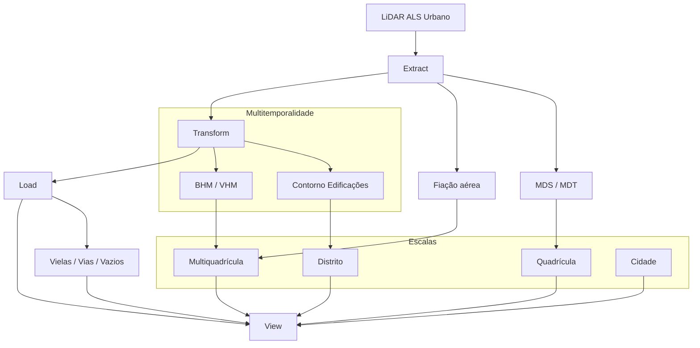

# Fundamentos LiDAR 3D+t

## Descrição

Treinamento em **geoprocessamento** de nuvens de pontos **LiDAR 3D multitemporais** obtidas em ambiente urbano por ALS (Airborne Laser Scanning). O foco é a geração de *sub* e *superprodutos* **cartográficos** (MDT, MDS, BHM, VHM, contornos de edificações, vielas e vias) aplicados à análise morfológica de favelas na cidade de São Paulo.

O **método pedagógico** é orientado pela cultura Hacker e pelas quatro liberdades do paradigma GNU/Linux, traduzidas no ciclo **ETLV (Extract, Transform, Load, View)**. A proposta articula rigor técnico (Engenharia, Computação, Arquitetura e Ciência Política) à política de ciência aberta, estimulando práticas de modificação, reuso e distribuição de dados e pipelines.

## Forma

- 12 semanas
- Cada encontro: 30 min de exposição + 20 min de discussão + 10 min de avaliação + tempo para confraternização
- Dedicação extra recomendada: 3 a 9 horas semanais (método **30:180**)
- 4 papéis: Aluna (Mestra), Aluno (Doutorando), Doutor Aluno, Doutor Professor

## Objetivos

Ao final do treinamento, a aluna será capaz de:

- Processar dados LiDAR 3D multitemporais em ambiente computacional/urbano.
- Extrair, calcular, derivar e visualizar produtos essenciais (MDT, MDS, BHM, VHM, contornos de edificações, trajetórias de vielas e vias).
- Utilizar **PDAL, Rasterio, NumPy, CloudCompare** e bibliotecas Python para construir fluxos ETLV reprodutíveis.
- Compreender progressão em escala espacial (quadrícula → distrito → cidade) e temporal (2017 → 2017+2020).

## Entregas e Produtos

1. **MDS / MDT / BHM / VHM**
    - Nuvens de pontos: LAZ, XYZ, Classes e atributos
    - Derivação de superfícies a partir do LiDAR
    - Primeira comparação temporal (2017)
    - Escala: favela São Remo, múltiplos arquivos

2. **Fiação aérea**
    - 3D + dados tabulares
    - Extração de feições lineares elevadas
    - Escala computacional expandida, comparação temporal

3. **Densidade, escalas, vizinhança e contornos**
    - Degradando o 3D → 2D → 1D → 0D
    - Altura de edificações e vegetação, segmentação de contornos, indicadores, MAUP (3D e 3D+t)
    - Comparação temporal entre 2017 e 2020

4. **Tudo em rede: Vielas, vãos, vias e vazios**
    - Processamento raster (NumPy, Rasterio)
    - Voxelização e vetorização de vazios urbanos
    - Escalas visuais, MAUP multidimensional e multitemporal

## Organização do repositório

- as aulas estão na pasta `aulas``
- os `downloads` realizados nas `práticas` devem ficar na sua respectiva pasta
- as `práticas` estão numeradas na mesma sequencia das aulas

## Aula a aula

> A ser atualizado

## Desafios transversais

- **Escala computacional:** 1 quadrícula → múltiplas → distrito → cidade
- **Escala temporal:** single-date (2017) → multi-date (2017/2020)
- **Ciclo ETLV:** presente em todas as etapas

## Softwares a instalar até o final da primeira aula

- **GNU/Linux** (ou WSL2)
- **Python 3.x** + Conda ou venv
- **GDAL/OGR**
- **PDAL**
- **QGIS**
- **Rasterio**
- **NumPy**
- **Panel** e/ou **NiceGUI**
- **Potree**
- **CloudCompare**

## Diagrama sistêmico paradigmático

## Referências

> “Uma aula não é feita para ser compreendida totalmente.  
> É feita para despertar algo em você.  
> É como se você estivesse em um ponto e a aula passasse em outro:  
> se uma faísca salta entre os dois, então valeu.”  
> — Gilles Deleuze, *O Abecedário de Gilles Deleuze* (1996)
