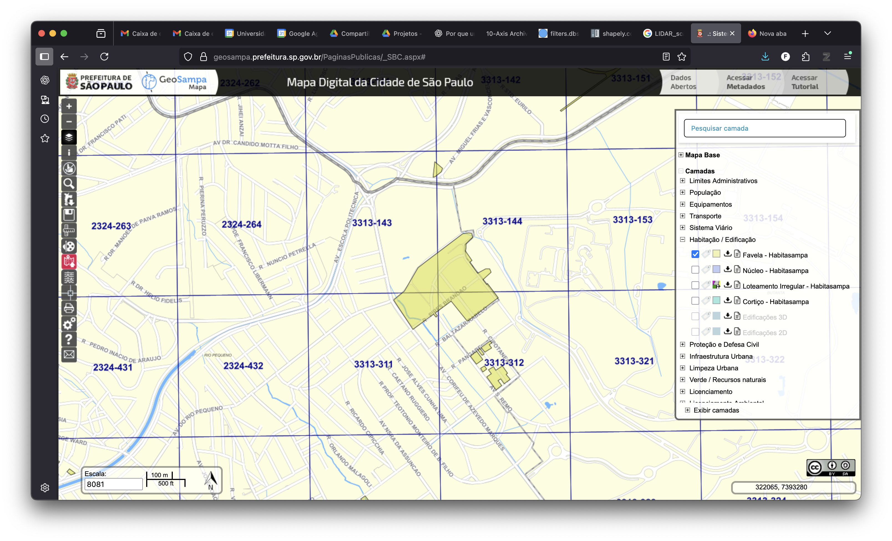
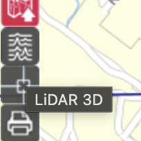

# Fundamentos do LiDAR  
### Da nuvem de pontos à cidade em 3D  

_Subtítulo: primeiros passos para compreender formatos, processamentos e aplicações_  

>Fernando Gomes, doutorando

    26/09/2025 | aula 1 de 12

---

## Agenda das próximas 3 aulas
0. essa aqui, apresentando o 3D e formatos
	- 1 quadrícula, carta ao milionésimo
1. MDS
	- 2 quadriculas, favela inteira
2. MDT
	- 4 quadrículas, favelas inteiras
3. BHM e VHM
	- 4 quadrículas, 2017/20, favelas inteiras 2017/20/24

---

## Contexto e aplicações  

- Dados abertos: **GeoSampa (PMSP)**.  
- Produtos comumente derivados:  
  - MDT (terreno)  
  - MDS (superfície)  
  - BHM (edifícios)  
  - VHM (vegetação)  
- Usos:  
  - Urbano, Hidrologia, Geoolgia, Engenharia
___

## LiDAR, nuvem de pontos e .LAZ?  

🔹 LiDAR (Light Detection and Ranging)
→ tecnologia
🔹 Nuvem de pontos
→ conjunto de pontos 3D (X, Y, Z, ...).
🔹 LAS (LASer file format)
→ padrão binário aberto da ASPRS (2003) para armazenamento de nuvem de pontos.
🔹 LAZ (LASzip)
→ versão comprimida lossless do LAS,Martin Isenburg (2013).

---

### Origem e princípios básicos **Wehr & Lohr (1999); Baltsavias (1999)**  

- Sistema ativo: emissão de pulso laser + tempo de retorno.  
- Permite múltiplos retornos → vegetação, telhado, solo.  
- Alta densidade de pontos, precisão vertical.  

---

### Estrutura e sistemas **Shan & Toth (2020)**  

- **ALS – Airborne Laser Scanning**  
- **TLS – Terrestrial Laser Scanning**  
- **MLS – Mobile Laser Scanning**  
- **SLAM – Simultaneous Localization and Mapping**  

➡ Geometria: GNSS + IMU + ângulo de varredura.  
➡ Fluxo: aquisição → filtragem → classificação → produtos (MDT, MDS).  

---

### Processamento e classificação **Vosselman & Maas (2010); Meng et al. (2010)**  

- Separar terreno / edificações / vegetação.  
- Métodos:  
  - TIN adaptativo (Axelsson, 2000).  
  - Filtros progressivos / morfologia.  
- Softwares: **CloudCompare**, **PCL**.  

---

### Formatos e padrões **ASPRS (2019); Isenburg (2013)**  

- **LAS**: padrão _aberto_ (LICENSE?), atributos (X,Y,Z, intensidade, retornos, ....).  
- **LAZ**: compressão lossless (LASzip), ~80% menor.  
- Estrutura: cabeçalho + pontos + atributos. 
- **EPT**: Entwine, streaming de nuvem de pontos

📄 [LAS Specification 1.4](https://www.asprs.org/wp-content/uploads/2019/03/LAS_1_4_r14.pdf)  
 

---

### 📚 Referências - Fundamentos
<!-- _class: small -->
- BALTSAVIAS, E. P. *Airborne laser scanning: basic relations and formulas*. ISPRS Journal of Photogrammetry and Remote Sensing, v. 54, n. 2–3, p. 199–214, 1999.  
- SHAN, Jie; TOTH, Charles K. *Topographic laser ranging and scanning: principles and processing*. 2. ed. Boca Raton: CRC Press, 2020.  
- VOSSELMAN, George; MAAS, Hans-Gerd. *Airborne and terrestrial laser scanning*. Dunbeath: Whittles Publishing, 2010.  
- WEHR, A.; LOHR, U. *Airborne laser scanning — an introduction and overview*. ISPRS Journal of Photogrammetry and Remote Sensing, v. 54, n. 2–3, p. 68–82, 1999.

---
<!-- _class: small -->
### Processamentos e libs
- CLOUDCOMPARE DEVELOPMENT TEAM. *CloudCompare (Version 2.x)* [GPL software], 2024. Disponível em: <https://www.cloudcompare.org>. Acesso em: 25 set. 2025.  
- MENG, Xiangyun; CURRIT, Nathan; ZHAO, Kaiguang. *Ground filtering algorithms for airborne LiDAR data: a review of critical issues*. Remote Sensing, v. 2, n. 3, p. 833–860, 2010.  
- RUSU, Radu Bogdan; COUSINS, Steve. *3D is here: Point Cloud Library (PCL)*. In: 2011 IEEE International Conference on Robotics and Automation (ICRA). Piscataway: IEEE, 2011. p. 1–4. DOI: https://doi.org/10.1109/ICRA.2011.5980567.  

---
<!-- _class: small -->
**Formatos e padrões**  
- ASPRS – American Society for Photogrammetry and Remote Sensing. *LAS specification, version 1.4 – R15*. Bethesda: ASPRS, 2019. Disponível em: <https://www.asprs.org/wp-content/uploads/2019/03/LAS_1_4_r14.pdf>. Acesso em: 25 set. 2025.  
- ISENBURG, Martin. *LASzip: lossless compression of LiDAR data*. Photogrammetric Engineering and Remote Sensing, v. 79, n. 2, p. 209–217, 2013.  

---
<!-- _class: small -->
**Contexto**  
- FREIRE, Paulo. *Pedagogia do oprimido*. 17. ed. Rio de Janeiro: Paz e Terra, 1987.  
- FREIRE, Paulo. *Educação como prática da liberdade*. 30. ed. Rio de Janeiro: Paz e Terra, 2001.  
- PREFEITURA DO MUNICÍPIO DE SÃO PAULO. *GeoSampa*. São Paulo: PMSP, [20--]. Disponível em: <http://geosampa.prefeitura.sp.gov.br>. Acesso em: 25 set. 2025. 
- SYSTEMS, Phoenix LiDAR. Understanding LiDAR: Comprehensive guide. , 2024. Disponível em: <https://phoenixlidar.com/resource/article/understanding-lidar/>

---

## Pergunta Freireana **Freire (1987, 2001)** 

> “Se você já vê a forma da cidade todos os dias, o que o LiDAR pode te ensinar de novo sobre aquilo que já está diante dos seus olhos?”  

---



---

```Python
import pdal

pipeline_json = """
[
    {
        "type": "readers.las",
        "filename": "../downloads/MDS_color_3313-311.laz"
    },
    {
        "type": "writers.gdal",
        "filename": "resultados/MDS_color_3313-311_max_altitude.tif",
        "resolution": 0.5,
        "output_type": "max",
        "dimension": "Z",
        "gdaldriver": "GTiff"
    }
]
"""

pipeline = pdal.Pipeline(pipeline_json)
pipeline.execute()
```
---

## Resultados obtidos  
  
  - **MDS da cidade** urbanos.
    - https://www.kaggle.com/datasets/andasampa/dtm-dsm-sao-paulo
  - **Fatores climáticos** (SVF, insolação).
    - https://www.kaggle.com/datasets/feromes/sky-view-factor-sao-paulo

 -> [Visualizador 3D, LiDAR 2017, PMSP](https://visualizador-laz-web.s3-sa-east-1.amazonaws.com/index.html?xmax=368408&ymax=7420696&xmin=300984&ymin=7337816)

---
<!-- _class: small -->
Dedico a aula de hoje a ***Martin "LAZ" Isenburg*** foi um engenheiro de software e visionário que acreditava que até mesmo bilhões de pontos poderiam dançar com liberdade. Criador do LASzip, transformou o pesado em leve ao dar ao mundo o formato .LAZ, hoje a língua franca das nuvens de pontos. Mais do que um programador, foi um questionador, que abriu caminhos para cientistas, arquitetos e exploradores enxergarem a Terra de novos ângulos. Alguns poderiam o considerar uma pessoa difícil, marcada por uma mente inquieta e pela dor de uma doença que o acompanhou até o fim. Improvável não acha-lo excêntrico, provocador, às vezes até desconfortável em suas sátiras — como a que fez num primeiro de abril envolvendo sua arqui-inimiga declarada, a gigante ESRI. Mas como tantos gênios, foi também mal compreendido. Sua obra nos lembra que cada ponto, de vista, cada história, cada ferramenta que compartilhamos, partilhamos futuros possíveis — porque até os algoritmos podem carregar poesia, beleza e conforto.


