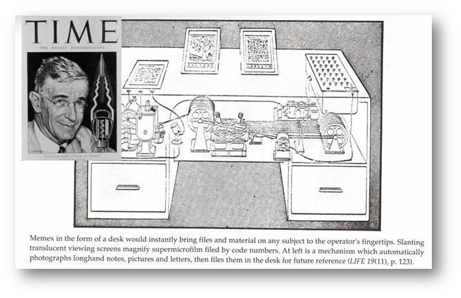

# 🌐 Do LAZ ao COPC.LAZ  
### O novo paradigma dos dados espaciais distribuídos (3D + t)

> Do papel ao voxel, do verbo ao vetor —  
> o que permanece é a vontade humana de pensar o mundo em rede.

---

## 🕸️ Dedicação  
**Vannevar Bush (1890–1974)**  
> As máquinas deveriam ampliar a mente humana, não substituí-la.

Engenheiro e visionário, propôs o **Memex** (1945) —  
a ideia de que o conhecimento deve ser **navegado por associação**,  
não arquivado linearmente.  
Antes da Web, antes do hipertexto, ele já sonhava o **acesso distribuído à informação**.

---
<!-- _class: small -->

## "O" artigo!

**Bush, Vannevar.** _As We May Think._ The Atlantic Monthly, v. 176, n. 1, p. 101–108, July 1945.
Disponível em: https://www.theatlantic.com/magazine/archive/1945/07/as-we-may-think/303881/

> O clima intelectual da época, **pós-Segunda Guerra Mundial:** diversos _cientistas_ que tinham trabalhado com radares, **computadores** e _controle de sistemas_ buscavam novas **linguagens** para descrever a mente e a máquina: **Movimento Cibernético** (p.e. Gregory Bateson)

---

## 🧠 O MEMEX e o nascimento da Cibernética  
<!-- _class: small -->
> “A mente humana opera por associação. O Memex é uma extensão dessa mente.” — Vannevar Bush, 1945 



---

## 📚 Do saber enciclopédico ao dado vivo  
<!-- _class: small -->
| Era | Paradigma | Símbolo |
|------|------------|---------|
| Enciclopédica | Conhecimento fixo e hierárquico | *Barsa* |
| Associativa | Conhecimento em rede | *Memex* |
| Colaborativa | Inteligência coletiva | *Wikipedia* |
| Processual | Aprendizado de máquina | *IA / Big Data* |
| Sensível | Mundo conectado | *IoT* |
| Espacial distribuída | Dados 3D+t acessíveis | *COPC* |

> “Deixamos de folhear o mundo e passamos a navegá-lo.”

---

## 🔄 A revolução silenciosa

> “Não é o dado que se move;  
> é o olhar que navega pelo dado.”

De **arquivos locais** → para **dados distribuídos**  
De **downloads integrais** → para **streaming seletivo**  
De **2D** → para **3D + tempo**

---

## 🧩 Do LAZ ao COPC  

| Conceito | LAZ | COPC |
|-----------|-----|------|
| Estrutura | Arquivo linear comprimido | Índice hierárquico (octree) |
| Acesso | integral (download) | parcial (HTTP Range) |
| Uso típico | armazenamento local | streaming cloud |
| Paradigma | cartografia estática | dados vivos 3D+t |

> O COPC é o **hipertexto do espaço** — acessamos apenas o que precisamos.

---

## ⚙️ Como o COPC funciona  

<!-- _class: small -->

- Organização em **octrees** (nós → blocos → pontos)  
- Cada nó contém **offsets e bounding boxes**  
- Lido sob demanda via **HTTP Range Requests**  
- Compatível com:  
  - PDAL  
  - QGIS ≥ 3.30  
  - Potree  
  - CloudCompare (plugin COPC)

> É o mesmo princípio do **COG** (Cloud-Optimized GeoTIFF), só que em 3D.

---

## 🧬 A gen(io)ealogia dos formatos  

```text
LAS  (ASPRS, 2003)
  ↓
LAZ  (Isenburg, 2011)
  ↓
EPT  (Entwine, Hobu Inc., 2017)
  ↓
COPC (Cloud Optimized Point Cloud, Hobu Inc., 2021)
```
---

## 🌱 O Dado Vivo  

> O que muda não é o formato do arquivo, é o formato do pensamento sobre o dado.
<!-- _class: small -->
- Do **dado armazenado** → ao **dado em fluxo**  
- Do **controle centralizado** → à **colaboração distribuída**  
- Do **dado passivo** → ao **dado que responde**

🧩 **O COPC é a expressão técnica de uma mudança cultural:**  
o dado deixa de ser algo “guardado” e passa a ser **navegado, interpretado e refeito em tempo real**.

> É o mesmo salto que Bush vislumbrou: o conhecimento como ecossistema, não como acervo.

---

## 🌀 Da Hierarquia à Heterarquia  

| Modelo | Estrutura | Exemplo |
|---------|------------|---------|
| Hierárquico | Topo → base | Catálogo, enciclopédia, mapa fixo |
| Heterárquico | Rede de relações | Web, STAC, COPC, LiDAR3D+t |
<!-- _class: small -->
- Na heterarquia, **cada elemento é um centro possível**.  
- O COPC encarna essa lógica: qualquer parte pode ser acessada primeiro.  
- Não há ordem fixa — há **acessos relacionais**.

> O dado 3D+t é uma topologia viva: múltiplos centros, múltiplas escalas, múltiplos tempos.

---

## 🌌 Do Memex ao LiDAR3D+t  

- 1945 → Vannevar Bush sonha o **Memex**  
- 1991 → Berners-Lee constrói a **Web**  
- 2021 → Hobu Inc. formaliza o **COPC**  
- 202? → O **LiDAR3D+t** torna o espaço urbano navegável em 3D e no tempo  

> Consegue imaginar uma máquina que pensa o espaço como uma rede viva?”

---

## 🌐 O Ecossistema Cloud-Native 3D+t (Apêndice)

Raster → COG (Cloud-Optimized GeoTIFF)
Vetores → MVT / pg_tileserv
Pontos → COPC (Cloud-Optimized Point Cloud)
Catálogo → STAC / pgSTAC

🧭 **Todos falam o mesmo idioma:**  
HTTP Range + JSON + Indexação hierárquica.


